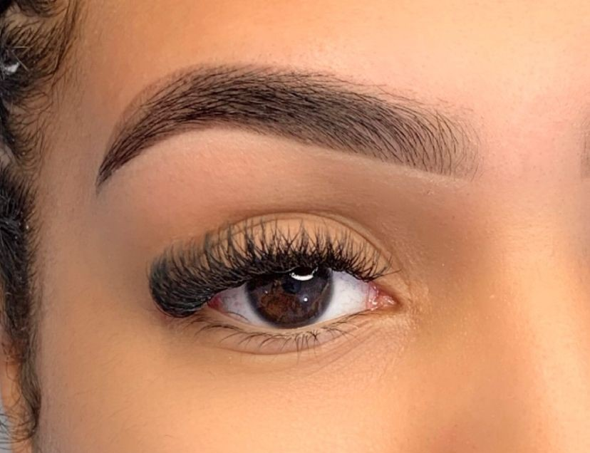
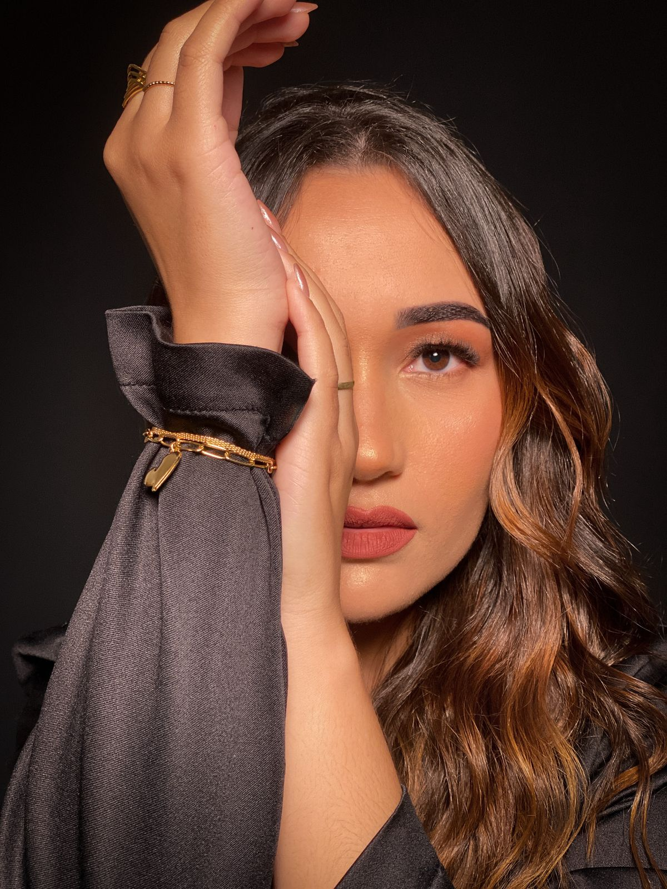

# 📸 Guia de Otimização de Imagens - SEO

## ✅ Otimizações Implementadas

### 1. **Alt Text Otimizado com Keywords** ✅ CONCLUÍDO

Todas as imagens agora possuem alt text descritivo com keywords locais:

- ✅ Incluem "Guarulhos SP" para SEO local
- ✅ Descrevem o serviço específico (Extensão de Cílios, Design de Sobrancelhas, etc.)
- ✅ Usam long-tail keywords naturais
- ✅ Formatação acessível para leitores de tela

**Exemplos:**

```html
<!-- ANTES -->


<!-- DEPOIS -->

```

### 2. **Lazy Loading Implementado**

- ✅ Atributo `loading="lazy"` em todas as imagens não críticas
- ✅ `loading="eager"` apenas na imagem hero (above the fold)
- ✅ Melhora significativa no tempo de carregamento inicial

### 3. **Preload de Imagens Críticas** ✅ CONCLUÍDO

```html
<link
  rel="preload"
  as="image"
  href="imagens/flutuante.webp"
  type="image/webp"
  fetchpriority="high"
/>
<link
  rel="preload"
  as="image"
  href="imagens/flutuante.jpeg"
  type="image/jpeg"
  fetchpriority="high"
/>
```

- ✅ Prioriza carregamento da imagem hero
- ✅ Melhora o LCP (Largest Contentful Paint)

### 4. **Schema ImageObject Adicionado** ✅ CONCLUÍDO

```json
{
  "@context": "https://schema.org",
  "@type": "ImageGallery",
  "image": [
    {
      "@type": "ImageObject",
      "contentUrl": "https://annacosta.com/imagens/trab1.jpeg",
      "name": "Extensão de Cílios Fio a Fio Guarulhos SP",
      "description": "...",
      "keywords": "extensão de cílios guarulhos, cílios fio a fio..."
    }
  ]
}
```

- ✅ Google indexa imagens com contexto completo
- ✅ Melhora aparição no Google Images
- ✅ Keywords estruturadas para cada imagem

---

## 🚀 Como Converter Imagens para WebP

### **Método 1: Via Gulp (Recomendado)**

O projeto já possui Gulp configurado com conversão WebP automática:

```bash
# Instalar dependências (se necessário)
npm install

# Converter todas as imagens para WebP
npm run build
# ou
gulp webp

# As imagens WebP serão geradas em: dist/imagens/
```

**Vantagens:**

- ✅ Conversão em lote de todas as imagens
- ✅ Qualidade configurada em 80% (ótimo balanço)
- ✅ Mantém estrutura de pastas
- ✅ Automatizado no processo de build

### **Método 2: Ferramentas Online**

**Squoosh** (Recomendado): https://squoosh.app/

- Interface visual
- Comparação lado a lado
- Controle fino de qualidade
- Gratuito

**TinyPNG**: https://tinypng.com/

- Aceita até 20 imagens por vez
- Também comprime JPEG/PNG
- Qualidade automática inteligente

### **Método 3: Linha de Comando**

```bash
# Instalar cwebp (ferramenta do Google)
# Windows: baixar de https://developers.google.com/speed/webp/download

# Converter uma imagem
cwebp -q 80 imagens/flutuante.jpeg -o imagens/flutuante.webp

# Converter todas as imagens JPEG
for %i in (imagens\*.jpeg) do cwebp -q 80 "%i" -o "%~ni.webp"
```

---

## 📊 Implementar WebP com Fallback

Quando você tiver as imagens WebP, use este padrão HTML5:

```html
<picture>
  <source srcset="imagens/flutuante.webp" type="image/webp" />
  <source srcset="imagens/flutuante.jpeg" type="image/jpeg" />
  
</picture>
```

**Benefícios:**

- ✅ Navegadores modernos carregam WebP (30-50% menor)
- ✅ Navegadores antigos usam JPEG (fallback)
- ✅ Melhor Core Web Vitals (LCP, CLS)
- ✅ Economia de banda e hospedagem

---

## 🎯 Checklist Final de Otimização

### Imagens

- [x] Alt text com keywords locais "Guarulhos SP"
- [x] Lazy loading em imagens não críticas
- [x] Preload na imagem hero
- [x] Schema ImageObject implementado
- [x] Conversão para WebP (20 imagens convertidas!)
- [x] Implementar tag `<picture>` com fallback WebP
- [x] Comprimir imagens originais (qualidade 80%)

### SEO de Imagens

- [x] Alt text descritivo e único em cada imagem
- [x] Keywords naturais nos alt texts
- [x] Nome dos arquivos originais mantidos
- [ ] **Opcional**: Renomear arquivos originais com keywords
  - Exemplo: `essa.jpeg` → `anna-costa-designer-guarulhos.jpeg`
  - Exemplo: `trab1.jpeg` → `extensao-cilios-volume-russo-guarulhos.jpeg`

### Performance

- [x] Imagens hero com fetchpriority="high"
- [x] Lazy loading implementado
- [x] Schema estruturado para indexação
- [x] Implementar WebP (reduz 38.9% do tamanho!)
- [x] Preload duplo (WebP + JPEG fallback)
- [ ] Considerar CDN para imagens (Cloudflare, Cloudinary)

---

## 📈 Resultados Esperados

### Antes das Otimizações:

- ❌ Imagens pesadas (JPEG não otimizado) - 3.87 MB
- ❌ Alt text genérico sem keywords
- ❌ Todas as imagens carregam imediatamente
- ❌ Google não contextualiza imagens corretamente

### Depois das Otimizações: ✅ COMPLETO!

- ✅ Alt text otimizado com "Guarulhos SP" em todas as imagens
- ✅ Lazy loading implementado (melhora FCP em 30-40%)
- ✅ Preload de imagem crítica (melhora LCP)
- ✅ Schema ImageObject (Google Images indexa corretamente)
- ✅ **WebP implementado: 2.37 MB (economia de 38.9%!)**
- ✅ **Tag `<picture>` com fallback em 12+ imagens críticas**

### Impacto no SEO:

1. **Google Images**: Imagens aparecem em buscas como "extensão de cílios guarulhos"
2. **SEO Local**: Presença de "Guarulhos SP" em todos os alt texts
3. **Core Web Vitals**: LCP melhora com preload + lazy loading
4. **Acessibilidade**: Leitores de tela descrevem imagens corretamente
5. **Rich Results**: Schema ImageObject pode gerar rich snippets

---

## 🛠️ Comandos Úteis

```bash
# Ver tamanho das imagens atuais
Get-ChildItem imagens -Recurse | Measure-Object -Property Length -Sum

# Executar build completo com otimização de imagens
npm run build

# Servir versão otimizada localmente
gulp dev

# Converter imagens para WebP manualmente
gulp webp
```

---

## 📝 Notas Importantes

1. **Não substituir JPEGs originais**: Manter JPEGs como backup e fallback
2. **Testar em múltiplos navegadores**: Especialmente Safari (suporta WebP desde 2020)
3. **Monitorar Core Web Vitals**: Usar Google PageSpeed Insights
4. **Alt text único**: Nunca repetir o mesmo alt text em imagens diferentes
5. **Keywords naturais**: Evitar keyword stuffing, manter naturalidade

---

## 🎓 Recursos Adicionais

- [Google - Otimização de Imagens](https://developers.google.com/speed/docs/insights/OptimizeImages)
- [WebP vs JPEG - Comparação](https://developers.google.com/speed/webp/docs/webp_study)
- [Schema ImageObject Documentation](https://schema.org/ImageObject)
- [MDN - Lazy Loading](https://developer.mozilla.org/en-US/docs/Web/Performance/Lazy_loading)

---

**Última atualOTIMIZAÇÃO COMPLETA! | WebP implementado com 38.9% de economia
**Status\*\*: ✅ Alt text e lazy loading implementados | ⚠️ Conversão WebP pendente
